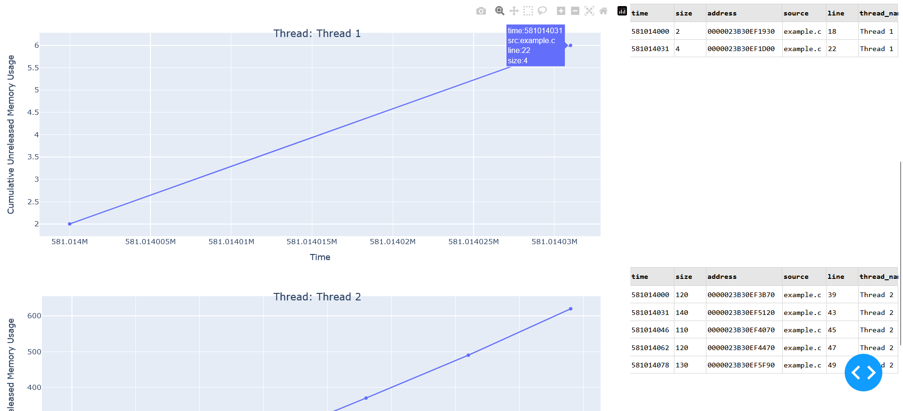

# MemoryLeak library
The library help to find memory leaks in embedded C.
It stores each unrealeased memory using a linked list.



## Contents
- [Usage](#usage)
- [How to run example on Windows](#how-to-run-example-on-windows)
- [How to build unit test](#how-to-build-unit-test)

## Usage
1. Copy `src/` directory to your project,
2. Uncomment the flag `#define MEMORY_LEAK_DETECTOR` inside the source file `memory_leak.h`,
3. Inlcude header file `#include "memory_leak.h"` in your code,
4. Adjust `src/interface.c` as you need,
5. While the program is running, you need to call a function: `memory_leak_print_result()`,
6. Copy the result and save it to a .txt file,
7. [Display your result on a graph and table](https://github.com/tymciox/heap_visualization)

## How to run an example on Windows
1. Preconditions, you need:
- Windows 10/11 system,
- `make`, 
- GNU Compiler Collection (e.g. `MinGW`).

2. Launch powershell in the main directory:
```
PS C:\memory_leak> make
gcc -Wall -Wextra -g -o example -Isrc src/memory_leak.c src/interface.c example.c
PS C:\memory_leak> .\example.exe
Memory Leak Summary
************************
587875281,2,000001D9232EFCE0,example.c,17,Thread 1
587875281,4,000001D9232F1AD0,example.c,19,Thread 1
587875296,120,000001D9232EFBD0,example.c,36,Thread 2
587875296,20,000001D9232EDEB0,example.c,75,Thread 3
587875328,40,000001D9232EDB40,example.c,79,Thread 3
587875328,140,000001D9232F2300,example.c,40,Thread 2
587875343,110,000001D9232F2480,example.c,42,Thread 2
587875359,60,000001D9232F0660,example.c,83,Thread 3
587875359,120,000001D9232F2570,example.c,44,Thread 2
587875375,130,000001D9232F26D0,example.c,46,Thread 2
***********************
```
3. Copy the result and save it to a .txt file. 
4. [Display your result on a graph and table](https://github.com/tymciox/heap_visualization)

## How to build unit tests
1. Preconditions, you need:
- Windows 10/11 system,
- `cmake`, 
- GNU Compiler Collection (e.g. `MinGW`).

2. Launch powershell in the main directory:
```
PS C:\memory_leak> cmake -S . -B BuildTest -G 'MinGW Makefiles'
-- The C compiler identification is GNU 13.2.0
-- The CXX compiler identification is GNU 13.2.0
-- Detecting C compiler ABI info
-- Detecting C compiler ABI info - done
-- Check for working C compiler: C:/Program Files/mingw64/bin/gcc.exe - skipped
-- Detecting C compile features
-- Detecting C compile features - done
-- Detecting CXX compiler ABI info
-- Detecting CXX compiler ABI info - done
-- Check for working CXX compiler: C:/Program Files/mingw64/bin/c++.exe - skipped
-- Detecting CXX compile features
-- Detecting CXX compile features - done
-- Configuring done (2.9s)
-- Generating done (0.0s)
-- Build files have been written to: C:/Users/tymci/Desktop/memory_leak/BuildTest

PS C:\memory_leak> cd .\BuildTest\

PS C:\memory_leak\BuildTest> make
[ 11%] Building C object test/CMakeFiles/Unity.dir/cunity/unity.c.obj
[ 22%] Building C object test/CMakeFiles/Unity.dir/cunity/unity_fixture.c.obj
[ 33%] Linking C static library libUnity.a
[ 33%] Built target Unity
[ 44%] Building C object CMakeFiles/memory_leak.dir/src/memory_leak.c.obj
[ 55%] Building C object CMakeFiles/memory_leak.dir/src/interface.c.obj
[ 66%] Building C object CMakeFiles/memory_leak.dir/test/TestProductionCode_main.c.obj
[ 77%] Building C object CMakeFiles/memory_leak.dir/test/TestProductionCode_Runner.c.obj
[ 88%] Building C object CMakeFiles/memory_leak.dir/test/TestProductionCode.c.obj
[100%] Linking C executable memory_leak.exe
[100%] Built target memory_leak

PS C:\Users\tymci\Desktop\memory_leak\BuildTest> .\memory_leak.exe    
Unity test run 1 of 1
....

-----------------------
4 Tests 0 Failures 0 Ignored
OK
```
